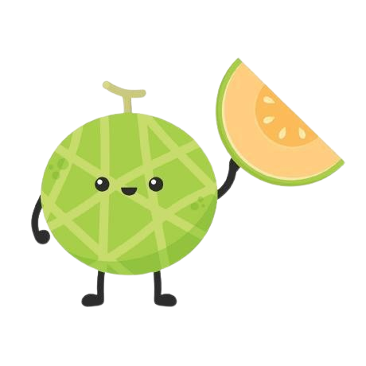

<picture>
  <source media="(prefers-color-scheme: light)" srcset="docs/assets/green-melon.png">
  
</picture>

`green-melon`: Make farming sustainable. 

<h3>

[Documentation](https://dinjazelena98.github.io/green-melon/)

</h3>

 🌿 **Broadleaf** → `0`  
 🌱 **Grass** → `1`  
 🌽 **Corn** → `2`  
 🌾 **Wheat** → `3`  
 🌻 **Sunflower** → `4`  
 

---

## Models for Each Target Crop vs. Weed Species

- **Broadleaf, Grass, and Wheat**  
- **Broadleaf, Grass, and Corn**  
- **Broadleaf, Grass, and Sunflower**

---